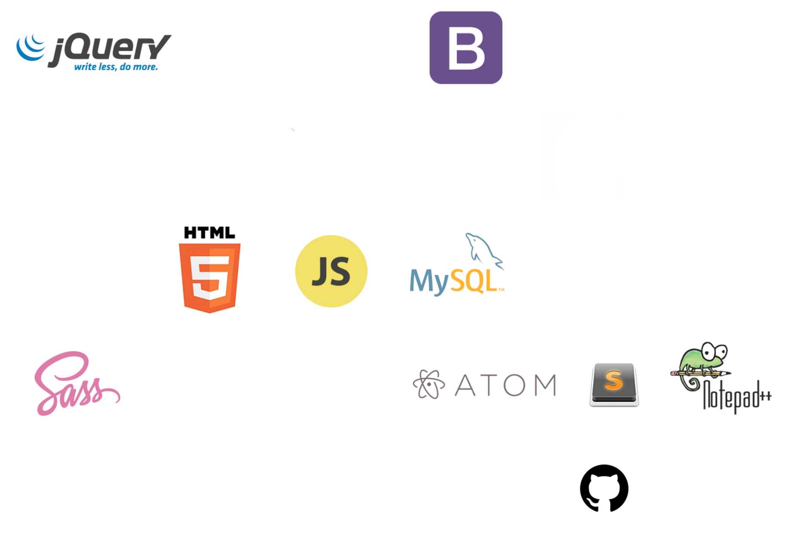

# Club Sessions Content
This repository contains my supplementary content for the sessions organized by AEC Coding Club. 

* ## Module 1:
    * Internet Basics
    * Intro to HTML5 & CSS3
    * Tips and Tricks - block vs. inline, margin, padding and border
    * Designing a Blog page - Walkthrough

> Timing : 2nd Week of September 

